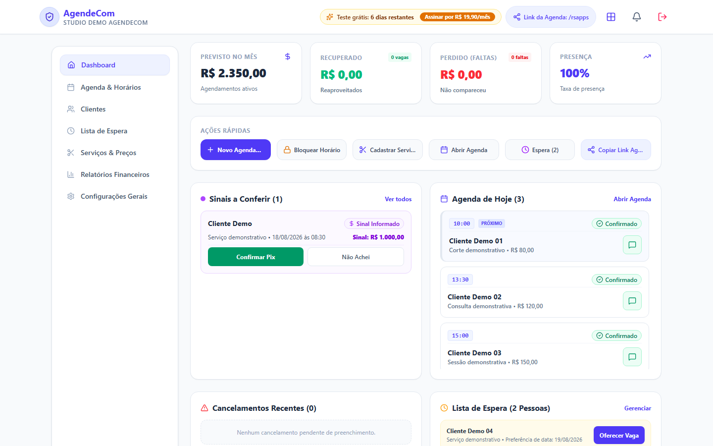
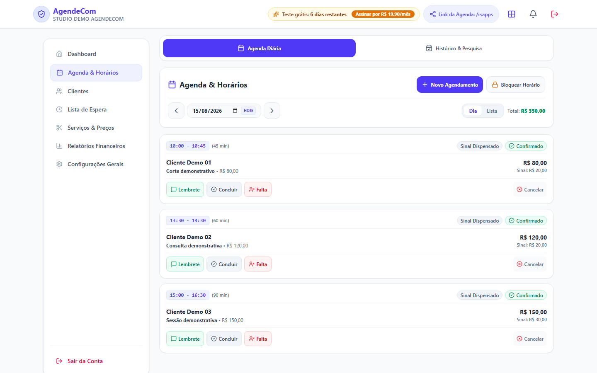
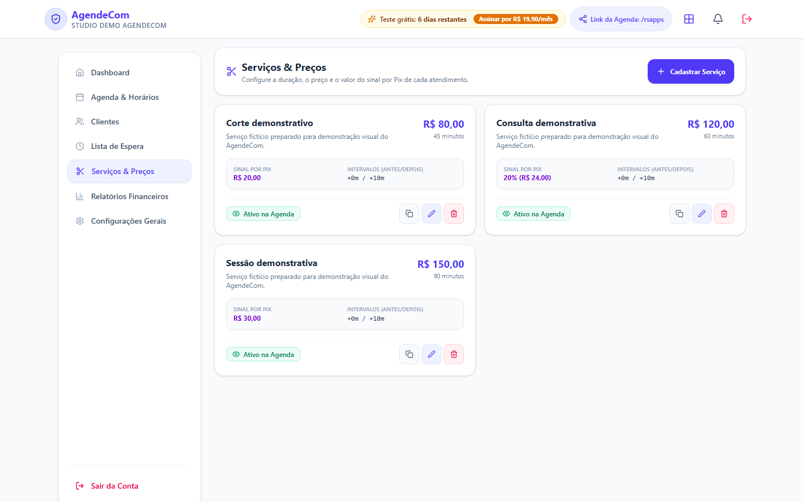
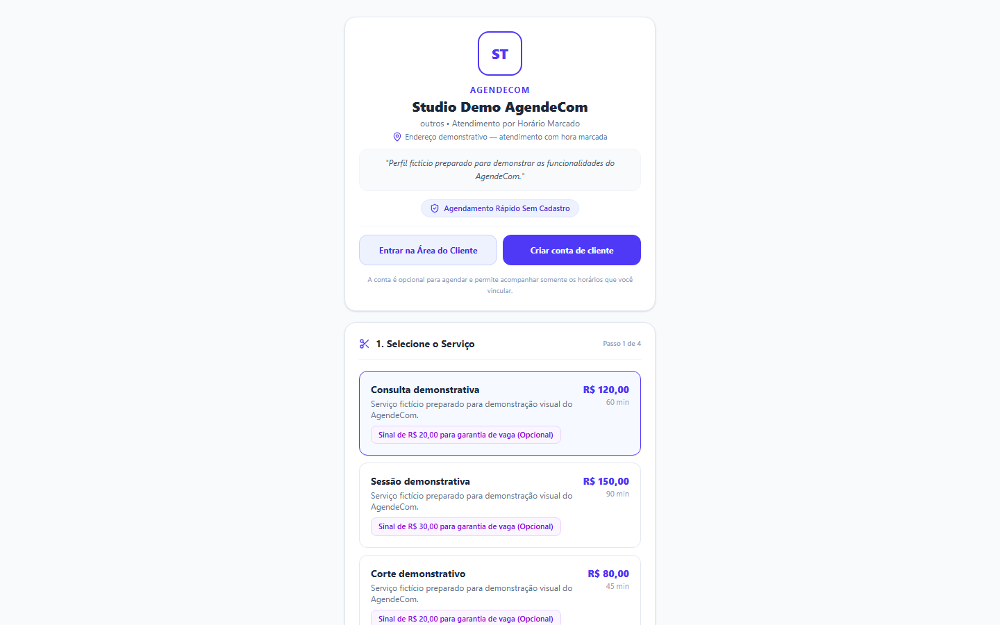
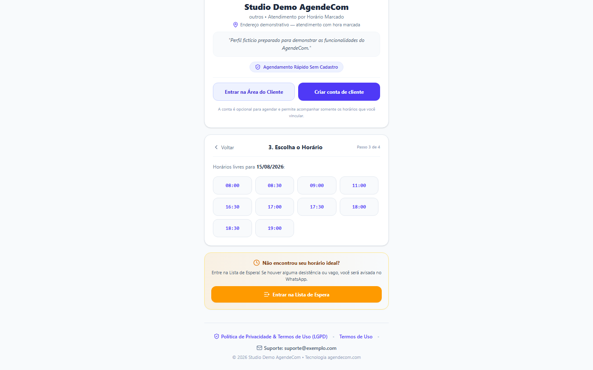
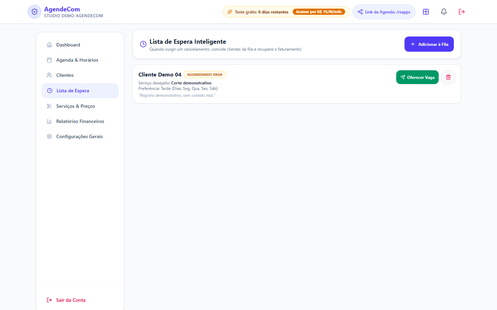
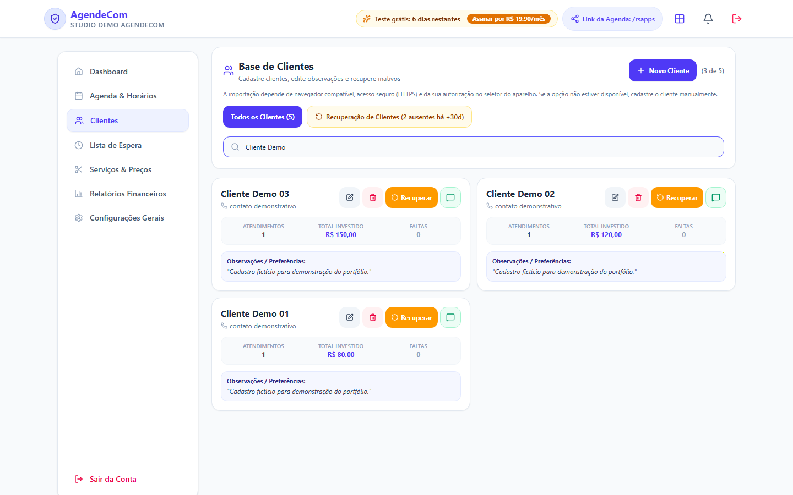
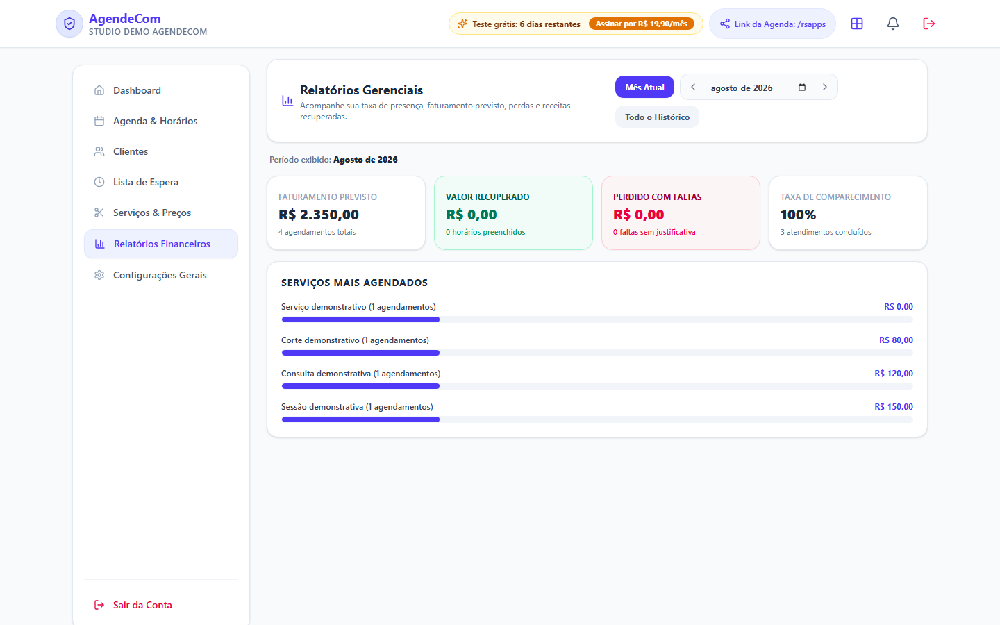
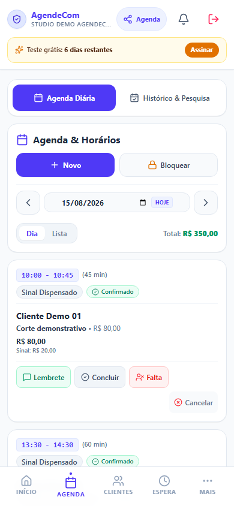
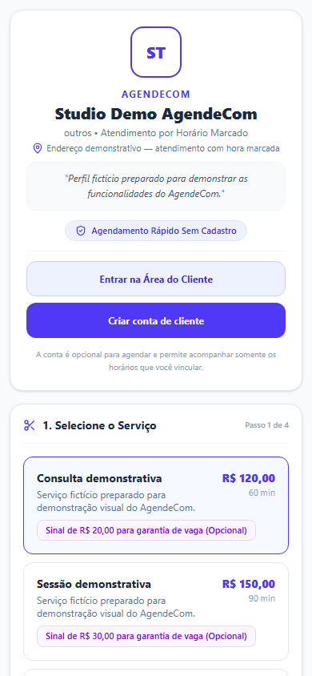

# AgendeCom

Aplicação web responsiva para profissionais organizarem serviços, clientes e horários, receberem solicitações de agendamento por link e acompanharem sua operação.

**Status:** em produção e em evolução.

**Acesse:** [agenda-b4b7c.web.app](https://agenda-b4b7c.web.app)



## Sobre

O AgendeCom foi desenvolvido para profissionais autônomos que trabalham com hora marcada. A aplicação reúne agenda, disponibilidade, serviços, clientes, sinais e lista de espera em uma interface única para desktop e celular.

O profissional configura o que oferece e compartilha sua página de agendamento. O cliente escolhe serviço, data e horário pelo link público, sem precisar criar uma conta. Uma área opcional permite vincular e acompanhar os próprios compromissos.

## Principais funcionalidades

### Agenda e disponibilidade

- agenda diária e consulta ao histórico;
- criação manual de atendimentos;
- bloqueio de horários;
- expediente por dia da semana, intervalos e limites de disponibilidade;
- acompanhamento de confirmação, presença, faltas, cancelamentos e sinais.

### Serviços

- cadastro de preço, duração e instruções;
- controle de disponibilidade pública;
- intervalos antes e depois do atendimento;
- sinal opcional com valor fixo ou percentual.

### Agendamento online

- página pública própria para cada profissional;
- escolha de serviço, data e horário disponível;
- solicitação com identificação e contato do cliente;
- agendamento sem cadastro obrigatório.

### Clientes

- cadastro, edição, busca e observações;
- histórico relacionado aos atendimentos;
- identificação de clientes inativos;
- importação de contatos em navegadores compatíveis, mediante autorização do usuário.

### Lista de espera

- registro de serviço e preferências de período;
- acompanhamento das pessoas aguardando vaga;
- preparação de convite com data, horário e link;
- abertura do WhatsApp para o usuário revisar e confirmar o envio.

### Relatórios

- faturamento previsto;
- valor associado a horários recuperados;
- perdas relacionadas a faltas;
- taxa de comparecimento;
- serviços mais agendados.

Os valores exibidos nas imagens são exclusivamente demonstrativos e não representam métricas comerciais do produto.

### Pix

O profissional pode configurar um sinal via Pix para o atendimento. O pagamento é realizado diretamente ao profissional; o AgendeCom gera as instruções e permite que o pagamento informado seja conferido na operação.

### Área do cliente

A conta do cliente é opcional. Ela permite vincular agendamentos recebidos por link, consultar próximos horários e histórico, confirmar presença e solicitar cancelamento dentro das regras configuradas.

### Assinatura da plataforma

A aplicação possui integração com Stripe para o fluxo de assinatura e acesso aos recursos profissionais.

## Como funciona

```text
Profissional configura serviços e disponibilidade
                    ↓
           Compartilha seu link
                    ↓
 Cliente escolhe serviço, data e horário
                    ↓
 Solicitação entra na agenda do profissional
                    ↓
 Profissional acompanha o atendimento e o sinal
                    ↓
Uma vaga pode ser oferecida à lista de espera
```

O convite da lista de espera é preparado pelo sistema e aberto no WhatsApp; o envio depende da confirmação do usuário.

## Demonstração visual

### Visão geral

O dashboard reúne indicadores, ações rápidas, compromissos do dia, sinais pendentes e oportunidades da lista de espera.


### Agenda organizada

A visão diária concentra horários, duração, cliente, serviço, valores e ações do atendimento.



### Configuração de serviços

Cada serviço pode ter duração, preço, sinal e intervalos próprios.



### Agendamento pelo cliente

O fluxo público apresenta o perfil profissional e conduz o cliente pela escolha do serviço, da data e do horário.





### Lista de espera

Preferências registradas ajudam o profissional a localizar pessoas interessadas quando surge uma vaga.



### Acompanhamento da operação

A base de clientes e os relatórios complementam a rotina de atendimento.





### Experiência mobile

| Agenda profissional | Agendamento público |
| --- | --- |
|  |  |

## Tecnologias

### Front-end

React, TypeScript, Vite e Tailwind CSS.

### Backend

Node.js, Express e Zod.

### Dados e autenticação

Firebase Authentication, Cloud Firestore e Firebase App Check.

### Infraestrutura

Firebase Hosting e Google Cloud Run.

### Integrações

Stripe, links para WhatsApp e geração de QR Code Pix.

### Qualidade

Vitest, Supertest, Firebase Emulator Suite, TypeScript e lint automatizado. Mais informações em [Qualidade e validações](docs/QUALITY.md).

## Documentação

- [Visão geral do produto](docs/PRODUCT_OVERVIEW.md)
- [Qualidade e validações](docs/QUALITY.md)
- [Demonstração em vídeo](media/video/README.md)

## Desenvolvimento

Projeto desenvolvido por Milton Rafael de Souza Garcia.

O código-fonte da aplicação é mantido em repositório privado. Este repositório contém somente documentação e materiais públicos de apresentação do projeto.
